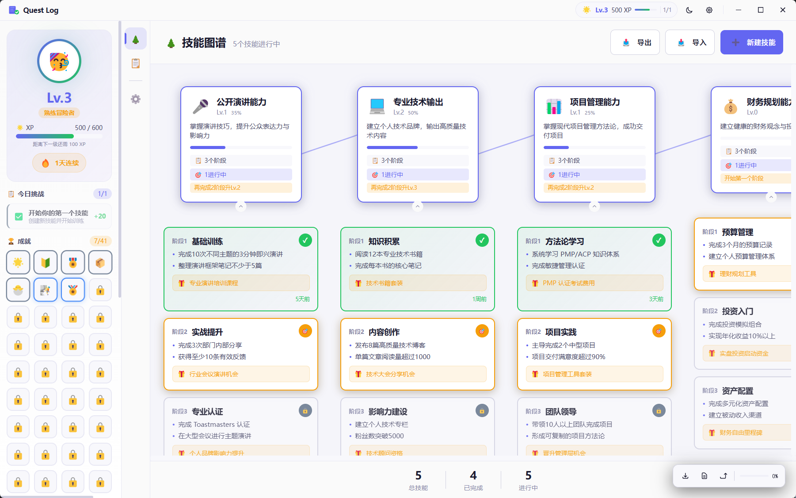
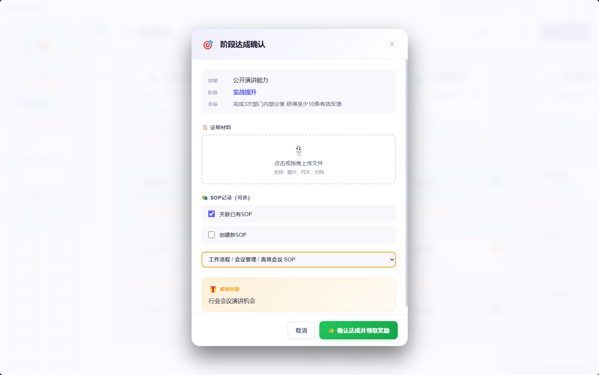
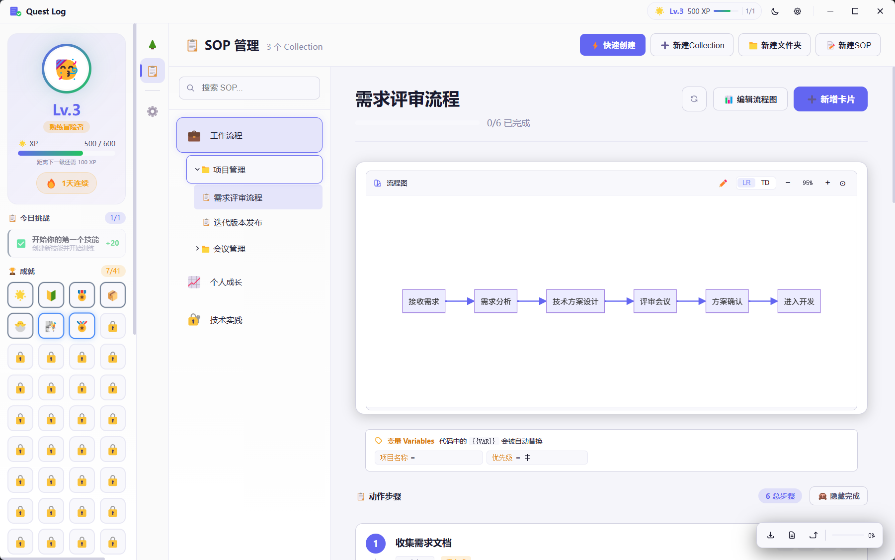
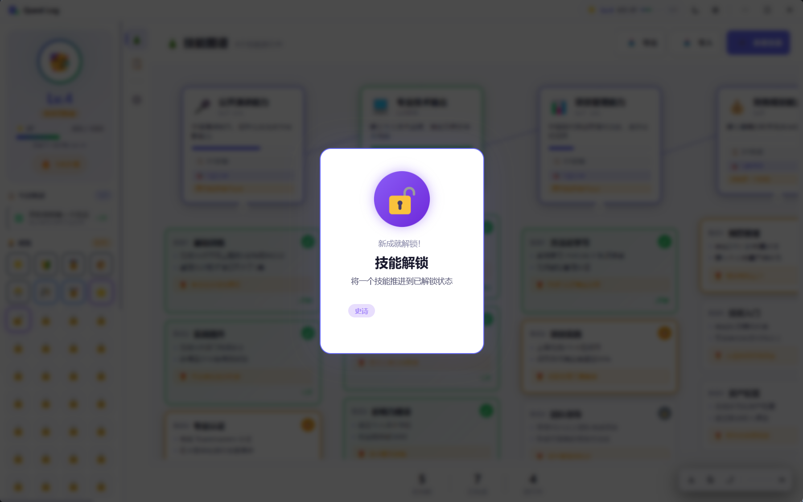
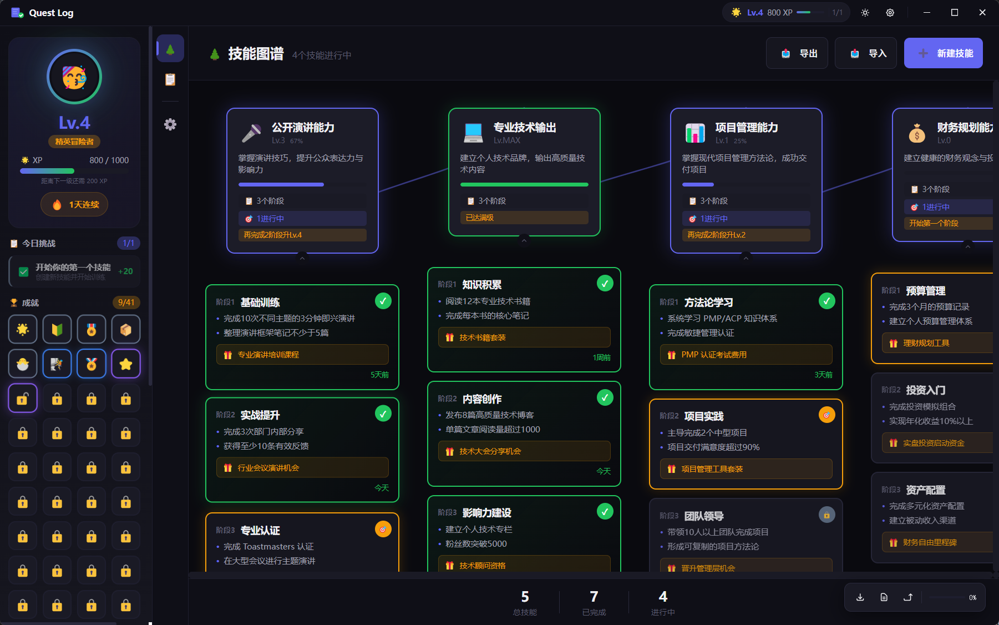
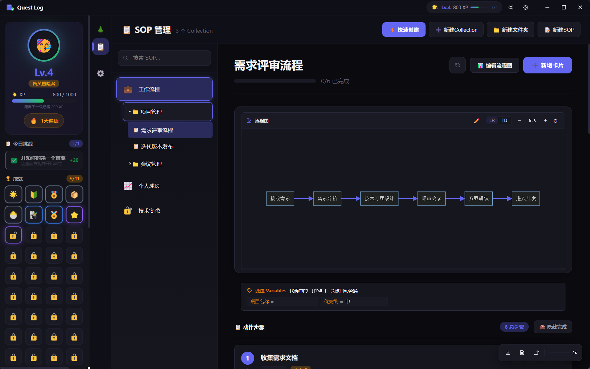

# Quest Log · 征途手记

<div align="center">


**执卷为引，踏歌而行**

*Guided by the scroll, walking to the song.*

</div>

---

## 🎯 它是什么

一款将**游戏化思维**融入人生规划与记录的工具。

我们常常觉得人生像是一场没有进度提示的硬核游戏，埋头赶路却不知道自己究竟完成了多少经验值，距离下一个"升级"还有多远。**Quest Log · 征途手记**想要做的，就是为你的人生旅途添加一份清晰的进度条。

> *"在这个被算法和即时反馈填满的时代，我们习惯了用别人的成功模板来衡量自己的坐标，却渐渐弄丢了自己真实的节奏。"*

每个人都在渴望一种清晰的掌控感——想知道当下的迷茫是不是必经的新手村，想知道每一次看似微小的努力，是否都在为未来的主线任务积攒着关键的经验值。

**这正是我们想要为你呈现的——一款将游戏化思维融入人生记录的工具。**

---

## ✨ 功能亮点

### 🌲 技能图谱
将宏大的成长目标拆解为可量化的技能树，每个技能拥有 Lv.0 ~ Lv.MAX 的进度追踪。

```
公开演讲能力 [Lv.2] (35%)
  ├─ 基础训练     ✅ 已完成
  ├─ 实战提升     🎯 进行中 ← 当前关卡
  └─ 专业认证     🔒 未解锁
```

### 🎖️ 阶段与里程碑
每个技能可拆解为多个阶段关卡，阶段内细分为可勾选的里程碑任务，让进度清晰可见。

### 📎 证明材料
支持图片、视频、文档、链接作为达成凭证，让每一次努力都有据可查。

### 📋 SOP 任务手册
为人生副本编写标准操作程序（SOP），将抽象目标转化为一步步可执行的动作卡片：

- **Mermaid 流程图** — 可视化任务流程
- **动作卡片** — 每个步骤独立卡片，支持代码高亮和变量替换
- **与技能树绑定** — SOP 可关联到具体技能阶段

### 🏆 游戏化激励
- **XP 经验值** — 每完成一个动作卡片、阶段获得即时反馈
- **等级系统** — 持续积累，解锁更高等级
- **成就系统** — 37 种成就等待解锁，从"初次探险"到"百日战士"
- **每日挑战** — 基于当前进行中的阶段自动生成

### 🎨 其他特性
| 功能 | 说明 |
|:---|:---|
| 主题切换 | 深色/浅色模式一键切换 |
| 本地存储 | 100% 本地存储，隐私优先 |
| 数据导入/导出 | Markdown 格式，与 AI 协同规划 |
| 跨平台 | Windows / macOS / Linux |

---

## 📸 运行演示

<div align="center">

### 技能图谱总览


### 技能详情与阶段管理


### SOP 任务手册


### 每日挑战与成就系统


### 暗色主题界面



</div>

---

## 🚀 快速开始

### 环境要求

| 项目 | 要求 |
|:---|:---|
| Node.js | 18.0+ |
| npm | 9.0+ |
| 操作系统 | Windows 10+ / macOS 10.15+ / Ubuntu 20.04+ |

### 1. 克隆项目

```bash
git clone https://github.com/realYurk/Quest-Log
cd Quest-Log
```

### 2. 安装依赖

```bash
npm install
```

> 国内网络建议设置镜像：
> ```bash
> npm config set registry https://registry.npmmirror.com
> npm config set ELECTRON_MIRROR https://npmmirror.com/mirrors/electron/
> ```

### 3. 开发模式

```bash
# 启动 Electron 桌面应用（推荐）
npm run electron:dev

# 或仅浏览器预览（数据存 localStorage）
npm run dev
```

### 4. 打包

```bash
# Windows x64 ZIP 压缩包
npm run build:win

# macOS DMG
npm run build:mac

# Linux AppImage
npm run build:linux
```

打包输出位于 `dist-electron/` 目录。

---

## 🗂️ 项目结构

```
Quest-Log/
├── electron/              # Electron 主进程
│   ├── main.js           # 窗口管理 / IPC / 文件监视器
│   ├── preload.js        # Context Bridge 安全 API
│   ├── seed.js           # 首次启动演示数据
│   └── sopFormat.js      # 导出格式工具
│
├── src/                  # Vue 源代码
│   ├── components/       # Vue 组件
│   ├── stores/           # Pinia 状态管理
│   ├── composables/      # Vue Composables
│   ├── types/            # TypeScript 类型定义
│   └── assets/           # CSS / 静态资源
│
├── public/               # 静态资源
├── package.json          # 项目配置
├── vite.config.ts        # Vite 构建配置
└── tsconfig.json         # TypeScript 配置
```

---

## 🛠️ 技术栈

| 层级 | 技术 |
|:---|:---|
| UI 框架 | Vue 3 + TypeScript |
| 状态管理 | Pinia |
| 构建工具 | Vite |
| 流程图 | Mermaid.js |
| 代码高亮 | Highlight.js |
| 桌面壳 | Electron 29 |
| 打包工具 | electron-builder |

---

## ❓ 常见问题

**Q: 打包后应用白屏**

A: 检查 `electron/main.js` 中 `backgroundColor: '#0f0f17'` 是否设置。

**Q: 下载 Electron 慢**

A: 设置镜像后重试：
```bash
npm config set ELECTRON_MIRROR https://npmmirror.com/mirrors/electron/
```

**Q: Windows 打包失败，提示 NSIS 错误**

A: 尝试使用 ZIP 模式打包：
```bash
# 修改 package.json 中 win.target 为 "zip"
npm run build:win
```

---

## 📜 开源协议

[Apache License 2.0](./LICENSE) — 可自由使用、修改、分发。

---

<div align="center">

**Quest Log · 征途手记**

*让每一次成长，都像在游戏里升级一样清晰可见*

*Every quest deserves a walkthrough.*

</div>
